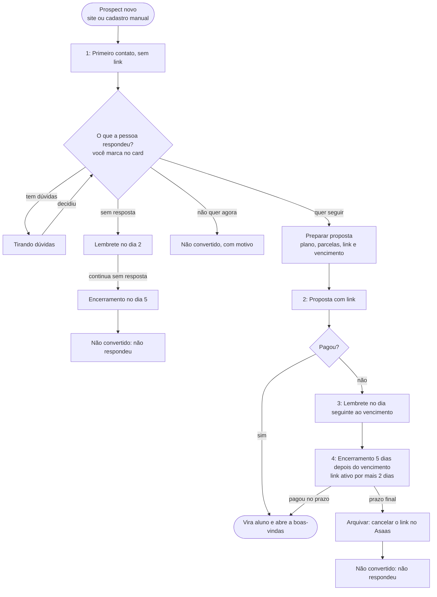
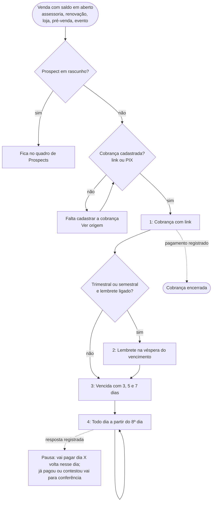

# Fluxos de mensagens

Conversas que o sistema puxa com o aluno pela Central de Comunicação. Cada
fluxo registra quem entra, os passos, o que trava e as decisões em aberto. As
mensagens são enviadas manualmente pelo WhatsApp; o sistema sugere o texto e
registra o envio quando o operador confirma.

Próximo fluxo a documentar: renovação.

## 1. Onboarding

Regra de entrada: `eon_private.communication_onboarding_eligible` (migrações
`20261007170000_onboarding_first_membership_only.sql`,
`20261007190000_onboarding_returning_students.sql` e
`20261007210000_onboarding_three_steps.sql`). O caso de onboarding é
aberto pelo gatilho do contrato e reavaliado a cada mudança relevante; quando a
regra deixa de valer, o caso fecha como `source_resolved`.

- Entram no mesmo onboarding o **aluno novo** (nunca teve contrato real na
  assessoria) e o **ex-aluno que volta** depois de mais de 30 dias sem contrato.
  Contrato real é ativo, vencido, em licença, encerrado, ou cancelado/agendado
  com pagamento. Rascunhos, prospects e contratos anulados não contam.
- Renovação, inclusive atrasada até 30 dias, não entra. O fim do contrato é
  exclusivo (`end_date`); no cancelado, o dia do cancelamento ainda conta.
- A ordem entre contratos vem da data de início, não da data de cadastro.
  Histórico importado depois (Tecnofit) e contratos de alunos migrados contam
  como contrato anterior.
- A boas-vindas só vale para pagamento dos últimos 30 dias (data do pagamento
  ou, sem ela, data de início). Depois dela, o check-in (dia 5) e o feedback
  (dia 20, pelo menos 7 dias depois do check-in) seguem por até 30 dias a partir
  da boas-vindas. O onboarding termina quando o feedback é registrado.
- Onboarding iniciado no painel anterior e com check-in registrado lá (evento
  com `source` diferente de `communication_case`) terminou no check-in e não
  volta para o feedback.
- Envio manual, sem travas: a Central mostra o texto para copiar, o atalho do
  WhatsApp e o botão “Registrar que enviei”. No onboarding, WhatsApp ausente,
  link da comunidade ausente ou passo antes da data não impedem o registro; só
  impedem etapa já concluída, contrato fora do onboarding (inclusive pagamento
  reaberto) ou modelo ausente. Cobrança e renovação mantêm as conferências.
- Textos: modelos `onboarding-welcome`, `onboarding-checkin-5d` e
  `onboarding-feedback-20d`, editáveis em Comunicação → Modelos e regras.

### Decisões em aberto

Decidido em 07/10/2026:

- Ex-aluno que volta recebe o mesmo onboarding do aluno novo. O limite de 30
  dias sem contrato para contar como retorno é o padrão adotado e pode ser
  ajustado.
- Três passos: boas-vindas no dia do pagamento, check-in no dia 5 e feedback no
  dia 20 (saber se deu certo, se está conseguindo e se ficou dúvida).
- Sem travas no envio: copiar o texto e registrar que enviou.

1. Mensagem apresentando o novo treinador quando a renovação troca de treinador.
2. Prazo da boas-vindas: hoje 30 dias depois do pagamento; sugestão inicial de 7.

## 2. Proposta

Do cadastro do prospect ao pagamento, no quadro de Prospects. Migração
`20261008150000_prospect_contact_flow.sql` (etapas `awaiting_reply` e
`clarifying`, datas do relógio e `register_assessment_prospect_contact`);
próximo passo e textos em `src/lib/assessment-prospect-flow.js`.

- Colunas: Novos → Aguardando resposta → Tirando dúvidas → Proposta pronta →
  Link enviado → Convertidos / Não convertidos. O card mostra o próximo passo e
  quando ele vence; o filtro e o contador "Para hoje" juntam o que já venceu.
- Primeiro contato: para cadastros do site. Cadastro manual e aluno atual vão
  direto para "Preparar proposta" (o atalho também vale para qualquer card).
  Em Novos, o card mostra há quanto tempo o cadastro chegou.
- Respostas: "Quer seguir" abre a proposta; "Tem dúvidas" leva a Tirando
  dúvidas; "Conversamos hoje" reinicia o relógio; "Não quer agora" e "Número
  não funciona" são motivos de Não convertido (`invalid_contact`, e também
  `other_service` para quem queria outro serviço).
- Relógio sem link (Aguardando resposta e Tirando dúvidas): lembrete 2 dias
  depois do último contato registrado; encerramento no dia 5, pelo menos 3 dias
  depois do lembrete. Registrar o encerramento arquiva como "Não respondeu".
- Relógio com link: lembrete de pagamento (o reenvio do link) no dia seguinte
  ao vencimento; encerramento 5 dias depois do vencimento, pelo menos 3 dias
  depois do lembrete. O encerramento deixa o link ativo por mais 2 dias; no
  prazo final o card pede para arquivar e, antes, cancelar o link no Asaas.
  Reenviar o link depois do encerramento retira o prazo.
- Antes do lembrete de pagamento e do encerramento com link, a janela consulta a
  fatura no Asaas (só leitura, a mesma do botão de Cobranças). Se já foi paga,
  mostra "Já pagou no Asaas" e o pagamento é registrado pela conferência, com
  confirmação. A coluna Link enviado tem "Conferir no Asaas" para todos de uma
  vez. Pagamento registrado converte o prospect e abre a boas-vindas.
- Envio manual e sem travas de data: copiar o texto (ou abrir o WhatsApp) e
  "Registrar que enviei". A janela avisa a data do último contato para conferir a
  conversa antes de cobrar.
- Textos ainda fixos no código (`assessment-prospect-flow.js` e a mensagem da
  proposta em `Prospects.jsx`).

### Decisões

Decidido em 08/10/2026:

- Primeiro contato sem link, perguntando se quer seguir ou se tem dúvidas.
- Sem resposta: lembrete no dia 2 e encerramento no dia 5, arquivando como "Não
  respondeu". O lembrete traz ajuda (explicação, áudio ou ligação), não "viu
  minha mensagem?".
- Com link: lembrete no dia seguinte ao vencimento e encerramento 5 dias depois,
  com o link ativo por mais 2 dias antes de arquivar.
- Conferência no Asaas no próprio card, com um clique para registrar e a
  boas-vindas abrindo em seguida.

1. Textos editáveis em Comunicação → Modelos e regras, como os do onboarding.
2. Retomar um prospect arquivado em um clique (hoje: "Novo prospect").

## 3. Cobrança

Toda venda com saldo em aberto, na Central de Comunicação. Regra em
`eon_private.communication_case_suggestion` (cobrança) e
`eon_private.ensure_communication_case`; ajustes na migração
`20261008190000_billing_flow.sql`.

- Entram as vendas com saldo em aberto: assessoria, renovação, loja,
  pré-venda e eventos. Prospect em rascunho fica no quadro de Prospects, com o
  lembrete e o encerramento da proposta. Renovação ainda na conversa do Pebinha
  fica no fluxo de renovação.
- Sem cobrança cadastrada (nem link nem PIX), o caso aparece como "Falta
  cadastrar a cobrança" e aponta para a venda ("Ver origem").
- Passos: cobrança com link no cadastro; lembrete na véspera do vencimento para
  planos trimestrais e semestrais (política em Comunicação → Modelos e regras,
  desligada até ser publicada); vencida com 3, 5 e 7 dias; a partir do 8º dia,
  todo dia, até a pessoa responder.
- Resposta registrada pausa a régua: "Vai pagar" com data volta nesse dia;
  "Informou que já pagou" vai para a conferência de pagamento; "Contestou" e
  "Precisa de atendimento" vão para revisão.
- "Desconsiderar mensagem e pular para a próxima": o passo da vez fica feito
  sem envio e sem mexer na venda (`message_skipped`). O lembrete diário volta no dia
  seguinte; o 3º dia pula para o 5º, e assim por diante.
- Sem travar a régua: se a cobrança com link ou o lembrete da véspera não forem
  enviados nem registrados, depois do vencimento a régua de atraso começa
  sozinha (as mensagens de atraso também levam o link). O lembrete da véspera
  não se repete no dia do vencimento.
- Antes de cobrar, a janela consulta a fatura no Asaas (só leitura). Se já foi
  paga, mostra "Já pagou no Asaas" e registra o pagamento pela conferência,
  com confirmação; o caso fecha sozinho.
- Diferente do onboarding, a cobrança mantém as conferências de data, link e
  WhatsApp no "Registrar que enviei".
- Textos: modelos `billing-*` em Comunicação → Modelos e regras. Os modelos de
  10 e 11 dias existem, mas a régua não usa (o diário começa no 8º dia).

### Decisões

Decidido em 08/10/2026:

- Cobrança todo dia depois do 7º dia, até a pessoa dar uma resposta.
- Lembrete na véspera para trimestral e semestral, com "Desconsiderar mensagem".
- Se nada for enviado nem registrado, a régua de atraso segue depois do
  vencimento.

1. O que acontece com o treino de quem não paga a renovação (fica para depois).
2. Textos de cobrança: acentos e tom dos modelos antigos.
