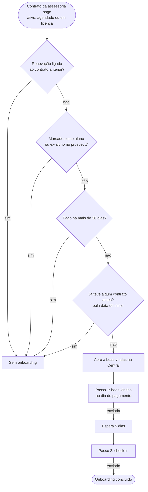

# Fluxos de mensagens

Conversas que o sistema puxa com o aluno pela Central de Comunicação. Cada
fluxo registra quem entra, os passos, o que trava e as decisões em aberto. As
mensagens são enviadas manualmente pelo WhatsApp; o sistema sugere o texto e
registra o envio quando o operador confirma.

Próximos fluxos a documentar: cobrança, renovação e proposta para prospect.

## 1. Onboarding

Regra de entrada: `eon_private.communication_onboarding_eligible` (migração
`20261007170000_onboarding_first_membership_only.sql`). O caso de onboarding é
aberto pelo gatilho do contrato e reavaliado a cada mudança relevante; quando a
regra deixa de valer, o caso fecha como `source_resolved`.

- **Aluno novo** é quem nunca teve contrato real na assessoria: ativo, vencido,
  em licença, encerrado, ou cancelado/agendado com pagamento. Rascunhos,
  prospects e contratos anulados não contam.
- A ordem entre contratos vem da data de início, não da data de cadastro.
  Histórico importado depois (Tecnofit) e contratos de alunos migrados contam
  como contrato anterior.
- Quem volta depois de um tempo fora não recebe o onboarding de aluno novo.
- A boas-vindas só vale para pagamento dos últimos 30 dias (data do pagamento
  ou, sem ela, data de início).
- Trava o envio: falta de WhatsApp válido, falta do link da comunidade
  (boas-vindas) ou pagamento reaberto.

### Decisões em aberto

1. Mensagem de “bem-vindo de volta” para quem retorna depois de um tempo fora,
   e quantos dias sem contrato contam como retorno.
2. Mensagem apresentando o novo treinador quando a renovação troca de treinador.
3. Prazo da boas-vindas: hoje 30 dias depois do pagamento; sugestão inicial de 7.
4. Passos do onboarding: manter boas-vindas no dia e check-in em 5 dias, ou
   acrescentar outro (ex.: check-in de 30 dias).
