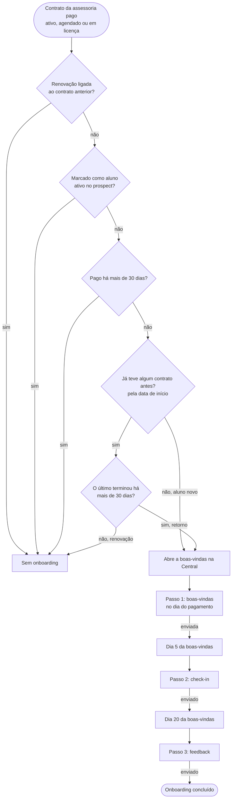

# Fluxos de mensagens

Conversas que o sistema puxa com o aluno pela Central de Comunicação. Cada
fluxo registra quem entra, os passos, o que trava e as decisões em aberto. As
mensagens são enviadas manualmente pelo WhatsApp; o sistema sugere o texto e
registra o envio quando o operador confirma.

Próximos fluxos a documentar: cobrança, renovação e proposta para prospect.

## 1. Onboarding

Regra de entrada: `eon_private.communication_onboarding_eligible` (migrações
`20261007170000_onboarding_first_membership_only.sql`,
`20261007190000_onboarding_returning_students.sql` e
`20261007210000_onboarding_three_steps.sql`). O caso de onboarding é
aberto pelo gatilho do contrato e reavaliado a cada mudança relevante; quando a
regra deixa de valer, o caso fecha como `source_resolved`.

- Entram no mesmo onboarding o **aluno novo** (nunca teve contrato real na
  assessoria) e o **ex-aluno que volta** depois de mais de 30 dias sem contrato.
  Contrato real é ativo, vencido, em licença, encerrado, ou cancelado/agendado
  com pagamento. Rascunhos, prospects e contratos anulados não contam.
- Renovação, inclusive atrasada até 30 dias, não entra. O fim do contrato é
  exclusivo (`end_date`); no cancelado, o dia do cancelamento ainda conta.
- A ordem entre contratos vem da data de início, não da data de cadastro.
  Histórico importado depois (Tecnofit) e contratos de alunos migrados contam
  como contrato anterior.
- A boas-vindas só vale para pagamento dos últimos 30 dias (data do pagamento
  ou, sem ela, data de início). Depois dela, o check-in (dia 5) e o feedback
  (dia 20, pelo menos 7 dias depois do check-in) seguem por até 30 dias a partir
  da boas-vindas. O onboarding termina quando o feedback é registrado.
- Onboarding iniciado no painel anterior e com check-in registrado lá (evento
  com `source` diferente de `communication_case`) terminou no check-in e não
  volta para o feedback.
- Envio manual, sem travas: a Central mostra o texto para copiar, o atalho do
  WhatsApp e o botão “Registrar que enviei”. No onboarding, WhatsApp ausente,
  link da comunidade ausente ou passo antes da data não impedem o registro; só
  impedem etapa já concluída, contrato fora do onboarding (inclusive pagamento
  reaberto) ou modelo ausente. Cobrança e renovação mantêm as conferências.
- Textos: modelos `onboarding-welcome`, `onboarding-checkin-5d` e
  `onboarding-feedback-20d`, editáveis em Comunicação → Modelos e regras.

### Decisões em aberto

Decidido em 07/10/2026:

- Ex-aluno que volta recebe o mesmo onboarding do aluno novo. O limite de 30
  dias sem contrato para contar como retorno é o padrão adotado e pode ser
  ajustado.
- Três passos: boas-vindas no dia do pagamento, check-in no dia 5 e feedback no
  dia 20 (saber se deu certo, se está conseguindo e se ficou dúvida).
- Sem travas no envio: copiar o texto e registrar que enviou.

1. Mensagem apresentando o novo treinador quando a renovação troca de treinador.
2. Prazo da boas-vindas: hoje 30 dias depois do pagamento; sugestão inicial de 7.
