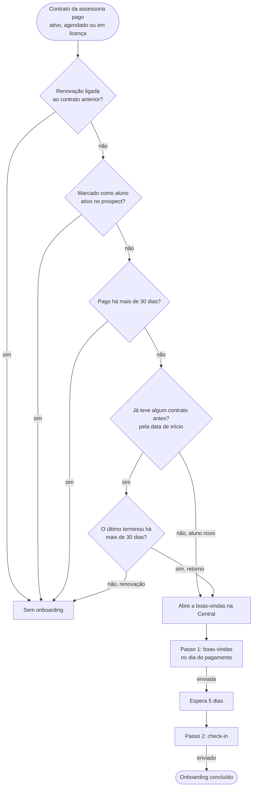

# Fluxos de mensagens

Conversas que o sistema puxa com o aluno pela Central de Comunicação. Cada
fluxo registra quem entra, os passos, o que trava e as decisões em aberto. As
mensagens são enviadas manualmente pelo WhatsApp; o sistema sugere o texto e
registra o envio quando o operador confirma.

Próximos fluxos a documentar: cobrança, renovação e proposta para prospect.

## 1. Onboarding

Regra de entrada: `eon_private.communication_onboarding_eligible` (migrações
`20261007170000_onboarding_first_membership_only.sql` e
`20261007190000_onboarding_returning_students.sql`). O caso de onboarding é
aberto pelo gatilho do contrato e reavaliado a cada mudança relevante; quando a
regra deixa de valer, o caso fecha como `source_resolved`.

- Entram no mesmo onboarding o **aluno novo** (nunca teve contrato real na
  assessoria) e o **ex-aluno que volta** depois de mais de 30 dias sem contrato.
  Contrato real é ativo, vencido, em licença, encerrado, ou cancelado/agendado
  com pagamento. Rascunhos, prospects e contratos anulados não contam.
- Renovação, inclusive atrasada até 30 dias, não entra. O fim do contrato é
  exclusivo (`end_date`); no cancelado, o dia do cancelamento ainda conta.
- A ordem entre contratos vem da data de início, não da data de cadastro.
  Histórico importado depois (Tecnofit) e contratos de alunos migrados contam
  como contrato anterior.
- A boas-vindas só vale para pagamento dos últimos 30 dias (data do pagamento
  ou, sem ela, data de início).
- Trava o envio: falta de WhatsApp válido, falta do link da comunidade
  (boas-vindas) ou pagamento reaberto.

### Decisões em aberto

Decidido em 07/10/2026: ex-aluno que volta recebe o mesmo onboarding do aluno
novo. O limite de 30 dias sem contrato para contar como retorno é o padrão
adotado e pode ser ajustado.

1. Mensagem apresentando o novo treinador quando a renovação troca de treinador.
2. Prazo da boas-vindas: hoje 30 dias depois do pagamento; sugestão inicial de 7.
3. Passos do onboarding: manter boas-vindas no dia e check-in em 5 dias, ou
   acrescentar outro (ex.: check-in de 30 dias).
